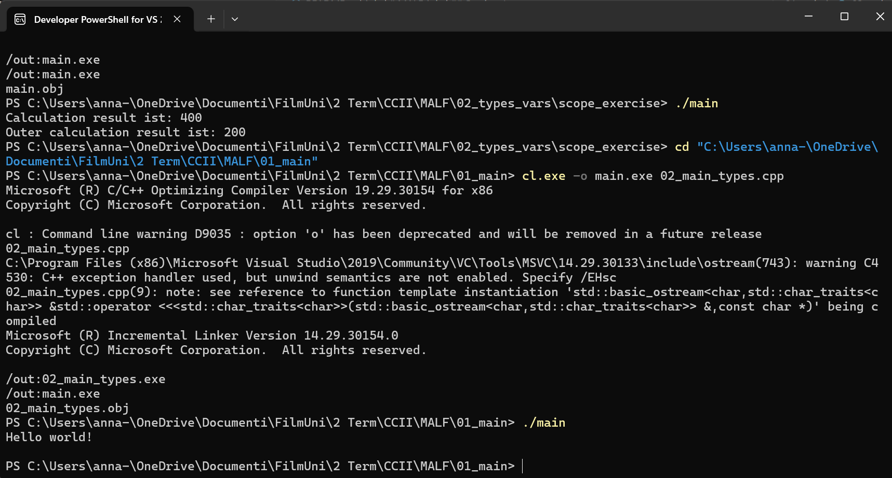
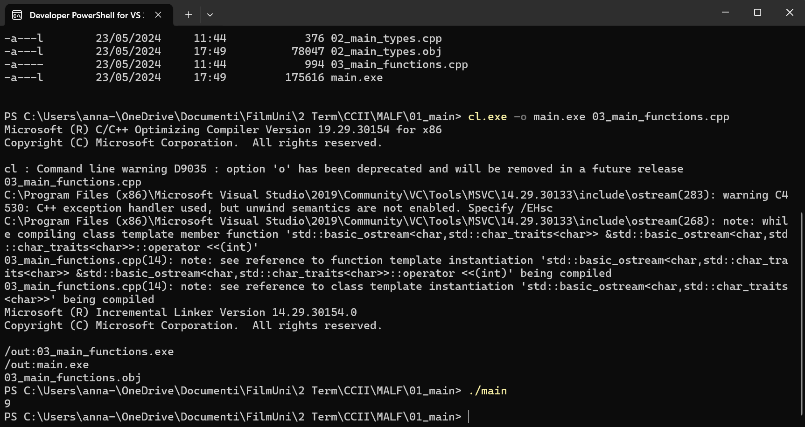
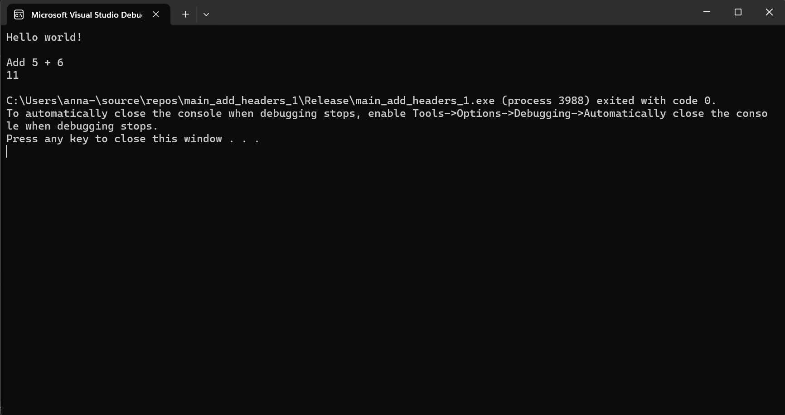
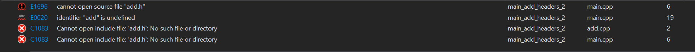
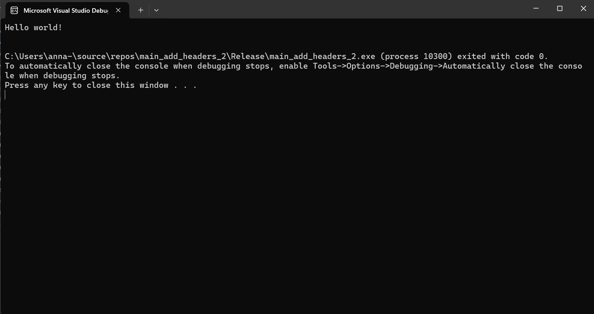
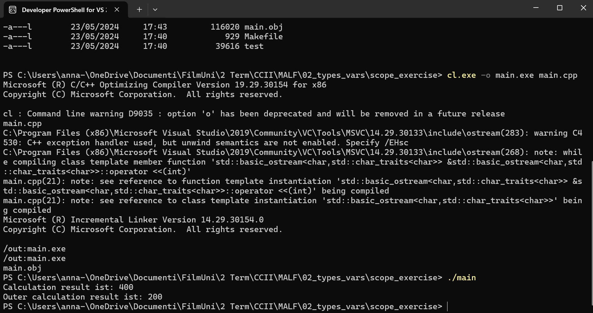
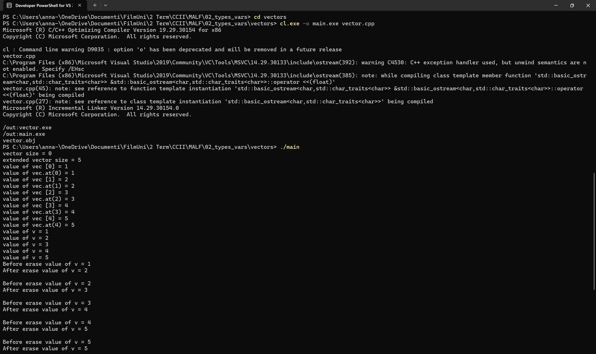
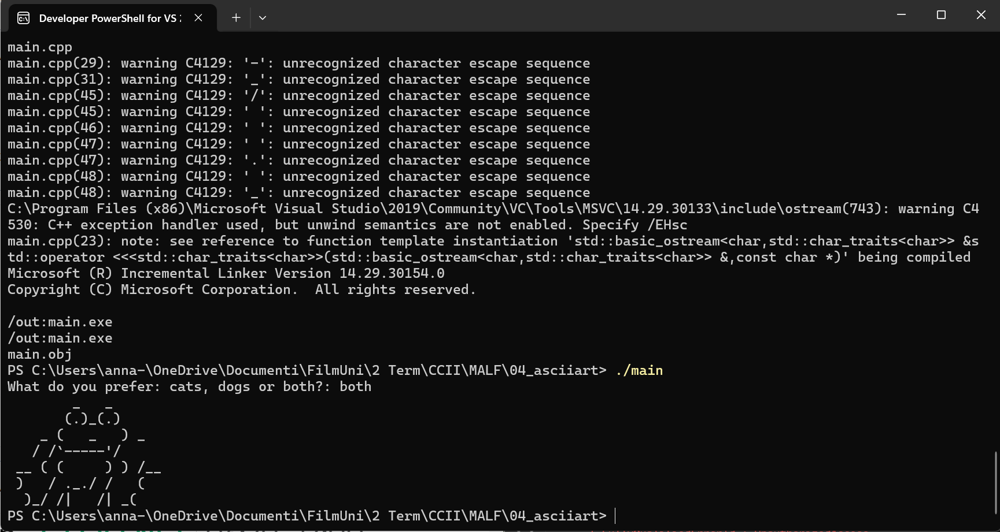
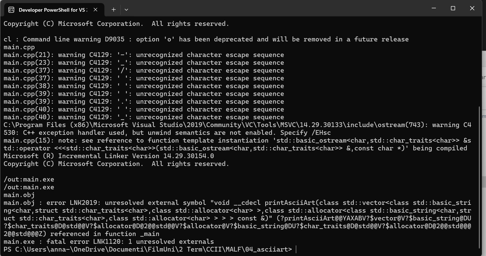
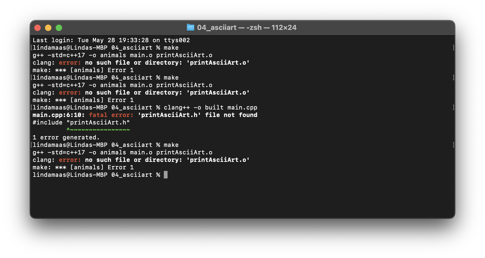

# MALF
Anna and Linda do code stuff!

# Session 1

## 01_main

## 02_main_types

## 03_main_functions

## main_add_headers_1

## main_add_headers_2

## main_makefile

## scope

1. Try to compile and run the application. What is the output?
   The output is 400/200, depending on the scope. This is not optimal, since both variables are called the same! 

## vector

we changed int with float 

## ASII Art 

