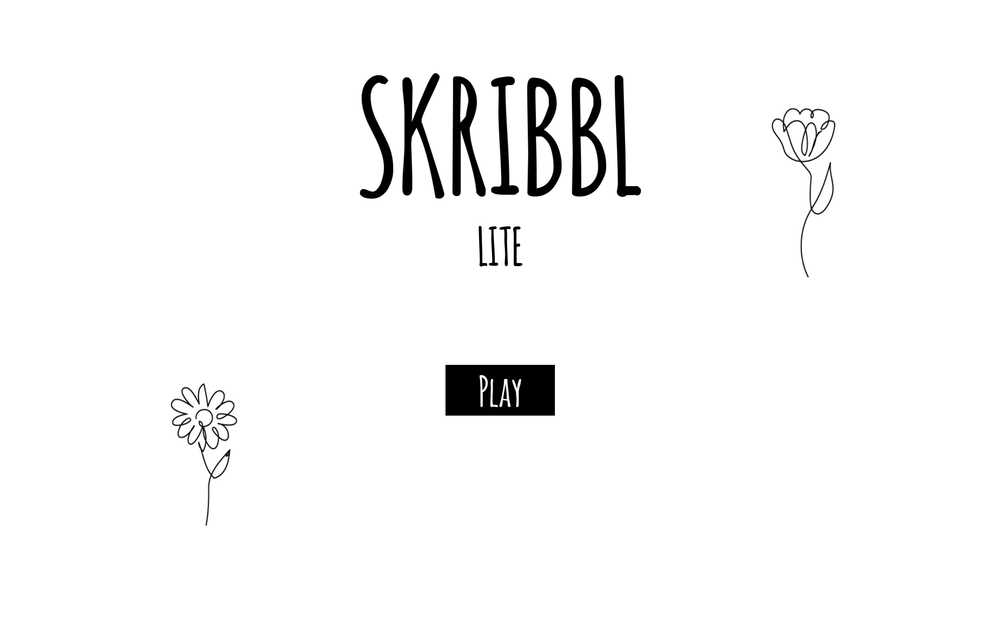

# SKRIBBL - LITE

### Concept

For the final project of this course, I came up with the idea of recreating the online game "Skribbl.io" (https://skribbl.io/), thinking it would be a nice way to bring together what I had learnt over the last term. 
Skribbl is a popular online multiplayer game where players take turns drawing images while others try to guess what the drawing represents. 
I worked on getting the basic functionality of the game and then worked a bit on the aesthetics of it.

### Instructions

The game can be played in multiple players. The game is played using one computer. Everyone must be able to see the screen.  The aim of the game is to guess a word that a player draws on the screen. 

1. Enter the players’ names.
2. The name of a player who will be the first to draw is drawn at random.
3. The other players close their eyes.
4. The player drawn chooses a word from the three causally proposed.
5. The other players can open their eyes again.
6. On the white screen the player can staart drawing the selected word and the other players will have to try to guess it (verbally). The length of the word is given given by the underscores at the top of the screen.
7. When a player guesses correctly, he is awarded the win by clicking on his button.

### Project Reflection and Discussion
- I really enjoyed working on this project. I tried to work on it using the concepts we learnt by creating different classes. I asked Chat-gpt for help and I could not have managed to get some of the functionality to work without it, but I also saw how it helped me to fix some concepts and understand better how the code works.
- The functionality is still very basic and there is certainly room for improvement. The more I managed to do, the more I wanted to add. Maybe I will try to continue, the first thing to do would be the scoring system.

### Video

// Here is a trailer of the game

https://owncloud.gwdg.de/index.php/s/AxQ59diI0ZTVNAG

