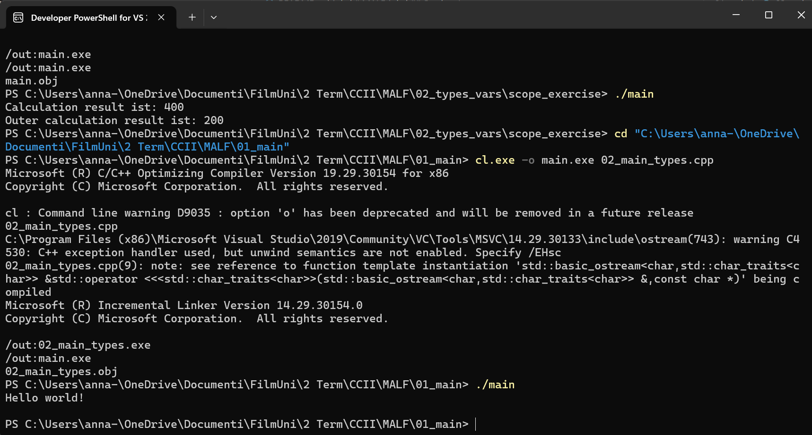
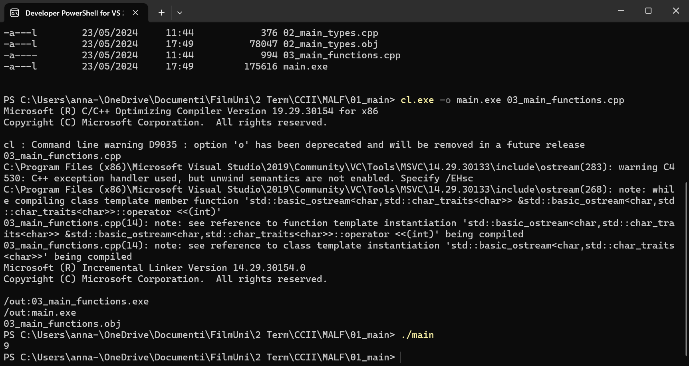
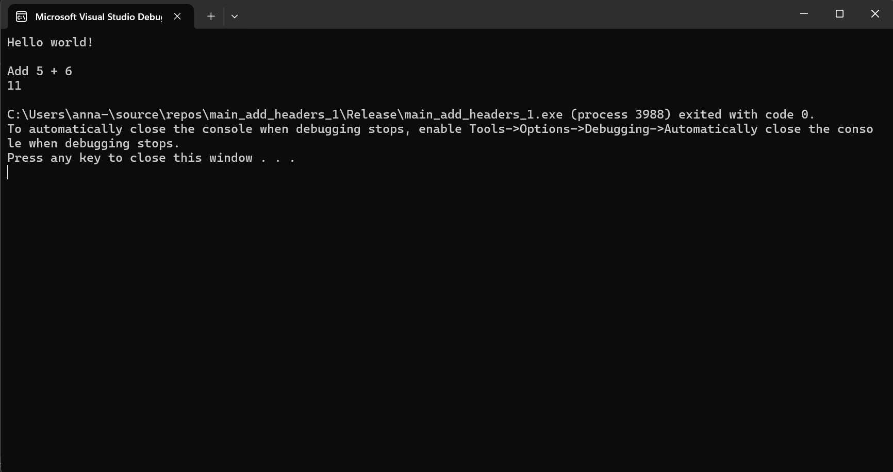
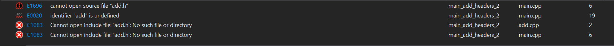

# MALF
Anna and Linda do code stuff!

## Session 1

We copied the code to our repro and built the application. 
1. Try to compile and run the application. What is the output?
   
The output is 400/200, depending on the scope. This is not optimal, since both variables are called the same! 

01_main

02_main_types

03_main_functions

main_add_headers_1

main_add_headers_2

